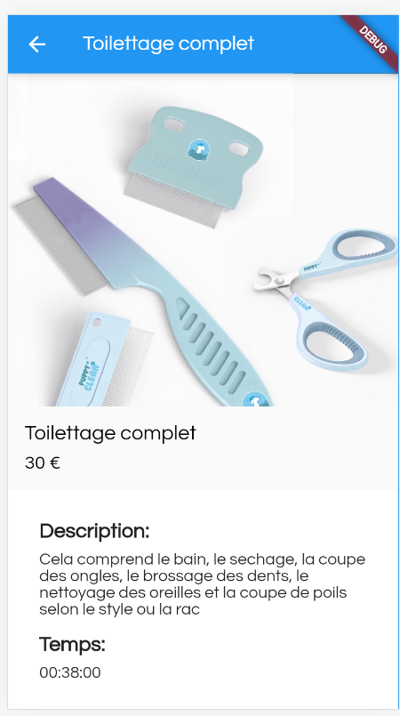
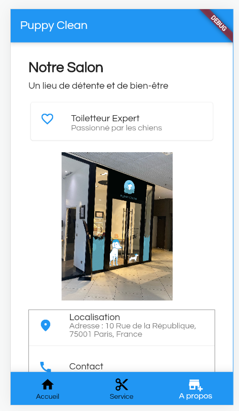

# Mon Application

Ceci est le repository de mon application "Puppy Clean" de mon application mobile développée avec Flutter.

## Fonctionnalités

- Fonctionnalité 1 : Permet voir des services proposés par le toiletteur
- Fonctionnalité 2 : Permet des voir les détails des différents services

## Captures d'écran

Homepage du site où l'on peut voir rapidement les différents services proposés et les plus choisies

Sur la page service où on a les différentes propositions de service du toiletteur

On a sur cette page, la description plus détaillées d'un service en particulier

On peut voir les informations importantes concernants le toiletteur

## Installation

1. Clonez le repository : `git clone https://github.com/Oceane86/appli_puppy_clean`
2. Allez dans le répertoire du projet : `cd appli_puppy_clean`
3. Installez les dépendances : `flutter pub get`
4. Lancez l'application : `flutter run`

## Contribution

Les contributions sont les bienvenues ! Si vous avez des suggestions, des rapports de bugs ou si vous souhaitez contribuer au projet, n'hésitez pas à ouvrir une issue ou à proposer une pull request.

## Licence

Ce projet est sous licence MIT. Veuillez consulter le fichier [LICENSE](LICENSE) pour plus d'informations.
